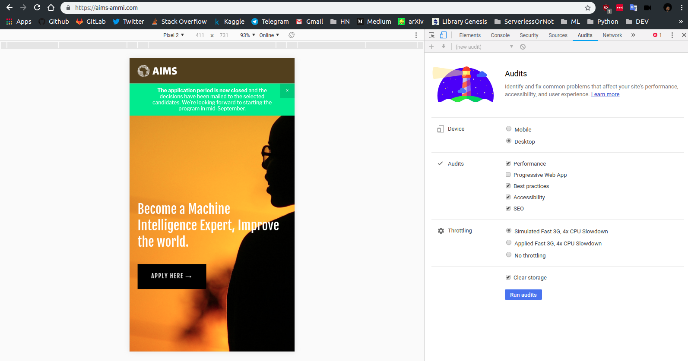
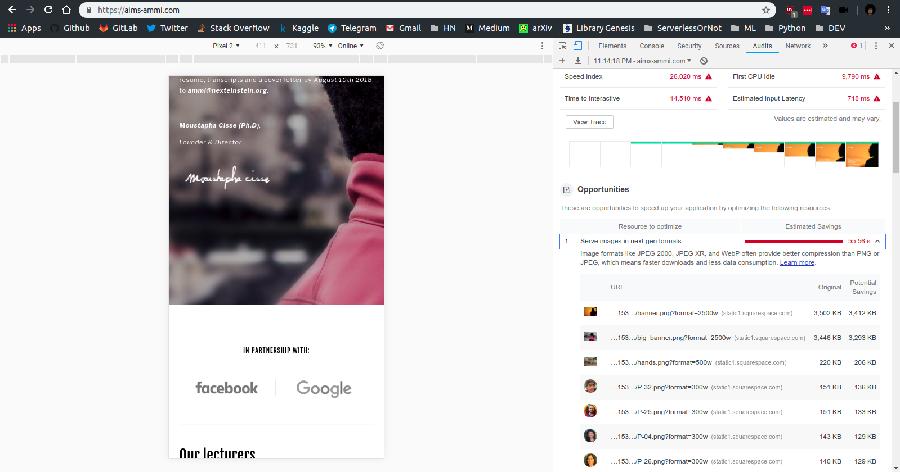

While navigating on the [AMMI site](https://aims-ammi.com/), I quickly realized that it was very slow to load. A quick Lighthouse audit was enough to confirm my feelings.

Several problems arise:
* 10 in performance
* two large images of 4mo each :whale2: :whale2:
And the static site builder uses (Squarespace) is as graceful as an elephant. So I decided to propose a version of the site completely redone, lightweight with HTML, [Bulma](https://bulma.io/) and vanilla JS.
## Roadmap
- [ ] Alternative new design
- [ ] Favicon
- [ ] Manifest
- [ ] Open Graph Protocol
- [ ] Contact form
- [ ] Press section

