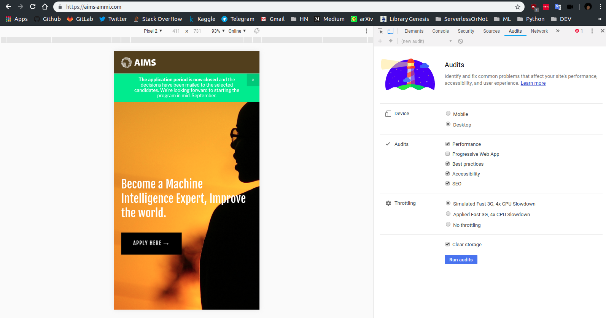
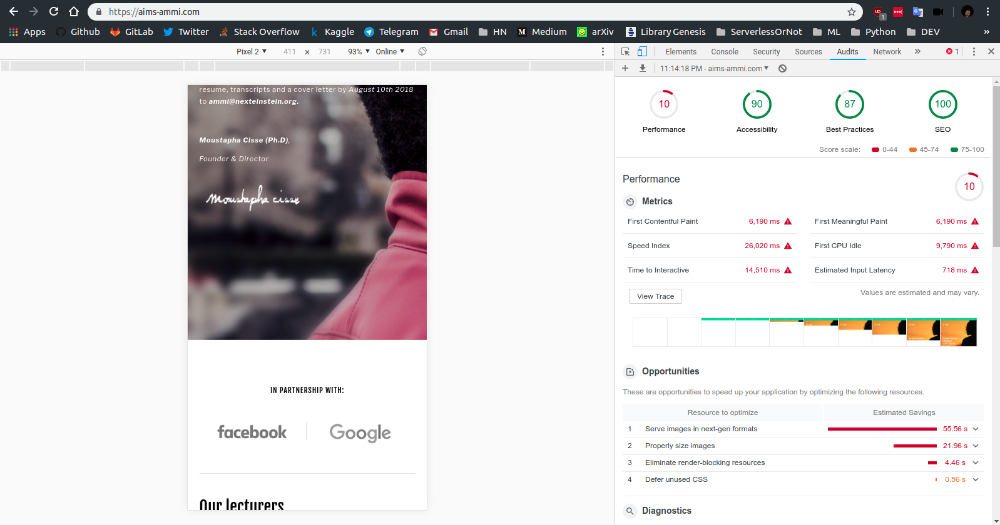
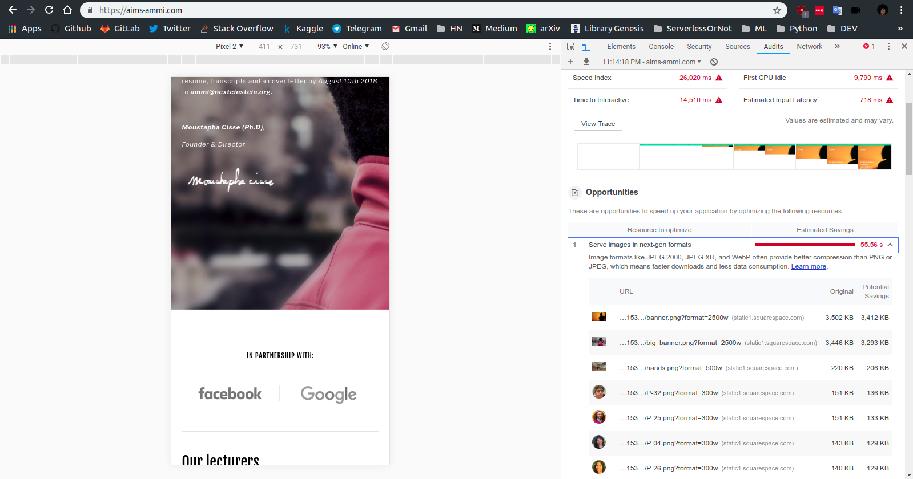

While navigating on the [AMMI site](https://aims-ammi.com/), I quickly realized that it was very slow to load. A quick Lighthouse audit was enough to confirm my feelings.

Several problems arise:
* 10 in performance
* two large images of 4MB each :whale2: :whale2:  
* the static site builder uses (Squarespace) is as graceful as an elephant.  

So I decided to propose a version of the site completely redone, lightweight with HTML, [Bulma](https://bulma.io/) and vanilla JS.

[Demo](https://suspicious-brown-5e9d1b.netlify.com/)
## Roadmap
- [x] Reproduce the current site
- [x] Compress all images: 13.2 MB to 1.7 MB
- [x] Improve performance: 10 to 81
- [x] Favicon
- [x] Manifest
- [x] Open Graph Protocol
- [ ] Pixel Perfect
- [ ] Use Web Components for the lecturer list
- [ ] Contact form
- [ ] Press section
- [ ] Alternative new design

